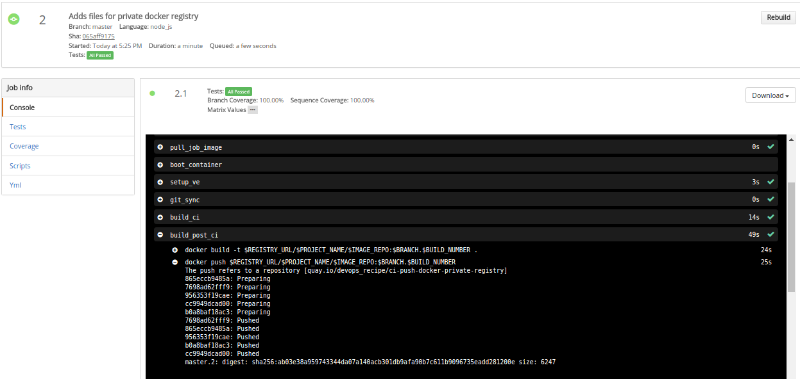

# Docker Build, Push and Continuous Integration for a Node JS application

 

A simple Node JS application with unit tests and coverage reports using mocha
and istanbul. It also does a docker build once CI posses and then pushes the image
to Quay

## Run CI for this repo on Shippable
* Fork this repo into your local repo
* Login into the [Continuous Integration Service](https://app.shippable.com)
* Create a Private Docker Registry [integration](http://docs.shippable.com/ci/push-quay/integrations/imageRegistries/privateRegistry/) on shippable to connect your Private Docker Registry
* All CI configuration is in `shippable.yml`
* Follow these [CI Setup Instructions](http://docs.shippable.com/ci/runFirstBuild/) if you have never used Shippable CI Service
* Update the integrationName in the integration.hub section if you used something other than `quay-integration`
* Change the REGISTRY_URL, IMAGE_REPO and PROJECT_NAME to point to your registry url, repo and project name
* You should be able to run a manual build or webhook build on commit

## CI Reports on Shippable

### CI Integration View

### CI Console Output

